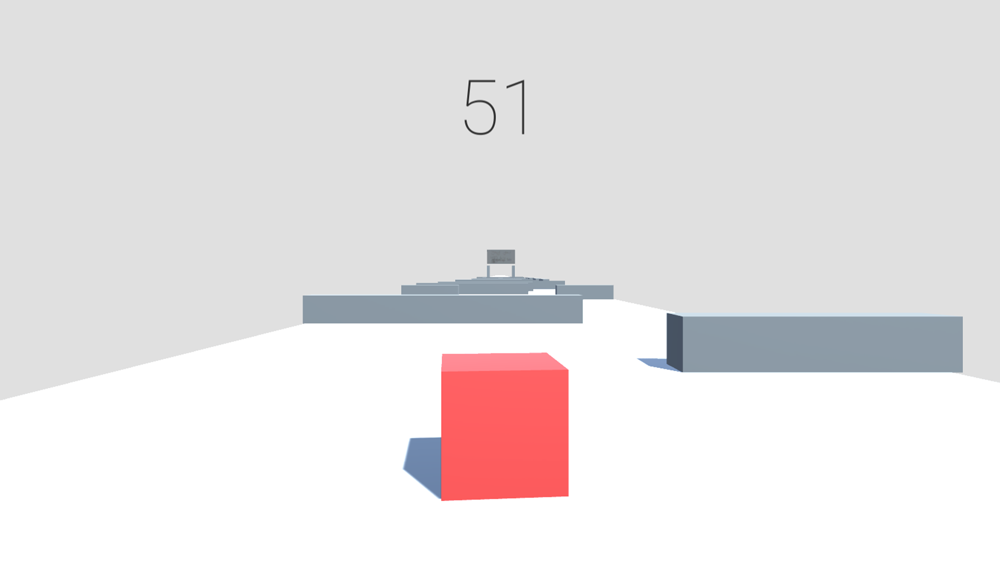

</img>

## Background

This game centers around your life as a well-lit 3D cube. As a well-lit 3D cube, you particularly enjoy running fast in a straight line, completley interrupted, using the `W` `A` `S` `D` keys. Alas, this is difficult as you're not alone. You're also coexisting with randomly-generating rectangular prisim walls (which are very strong)! What's that? They're also sitting perpendicular to the direction that you are traveling in? How inconvenient! They'll slow you down if you crash into them, so I suppose you must dodge them, which takes some skill (hmm... see where this is going? Yes, this is an advertisement).

**Included:** 
- Share map seeds (specifying the arrangement of walls) with your friends to compete head-to-head for the lowest time!
- Compete with tournament course leaders to earn a spot on the global leaderboard!
- Customize your cube's appearance!

## Technical Details

Created with the Unity 3D Game Kit, written in C#.

## Links

- [Source Code (GitHub)](https://github.com/bendatsko/cuberun)

