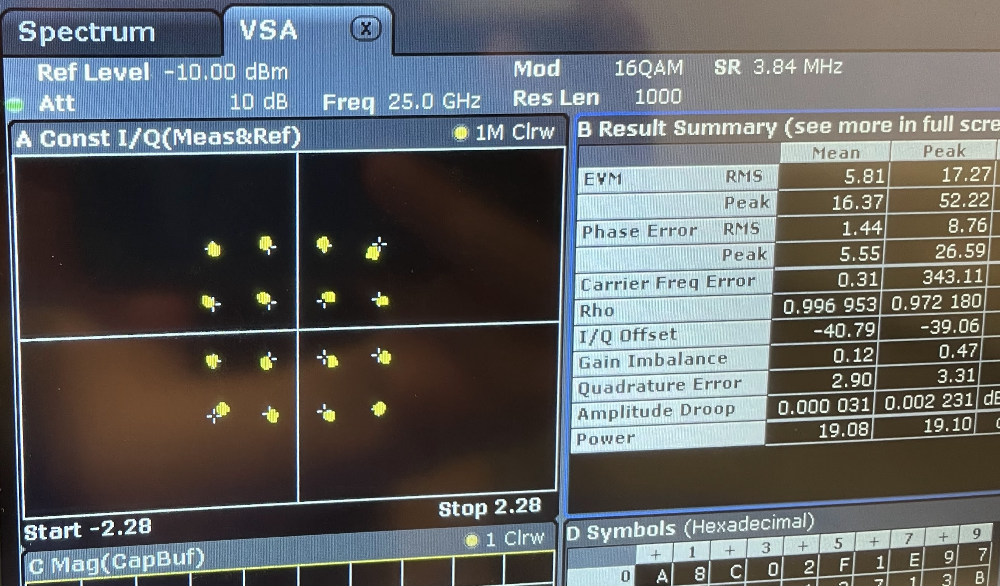

    

         
        
<strong>Figure 1</strong>: Prototype chip on custom substrate PCB in PLCC socket (Piston motherboard). Prototype die measures 3.2 x 5.1mm.

    

## Abstract
Used for the beamformer. Versatile low-cost approach to modulated signal generation (costs $10K rather than $100k). Made of ADI components and programmed in MatLab. 

## Key Features
- ADI FPGA
- ADI DAC
- Broadband upconverter
- 1GHz RF source (10 MHz clock synchronization)
- 128 MHz Clock Source (10 MHz clock synchronization)
- *R&S spectrum analyzer (10 MHz clock synchronization)
- *5V external power supply to upconverter

_Block diagram here_

## User Guide/Usage Explanation
_User guide rephrased -- Additional images may be useful here_